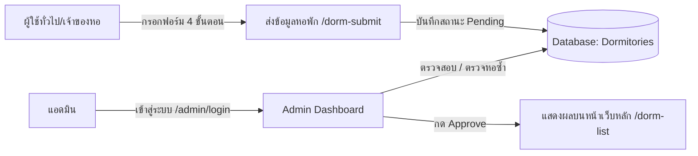
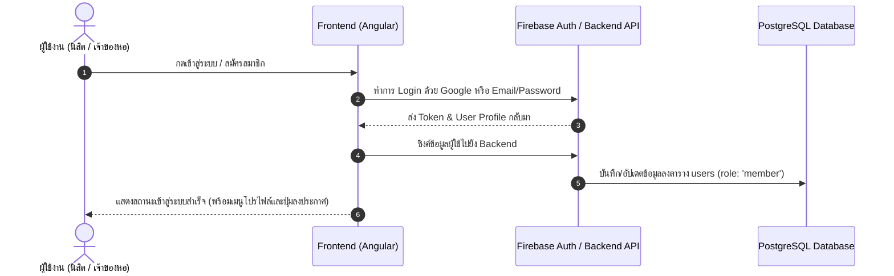
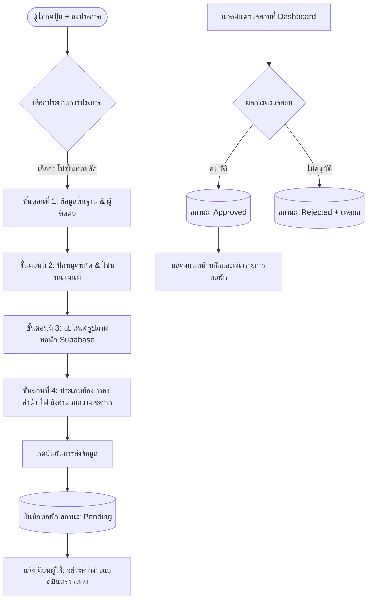
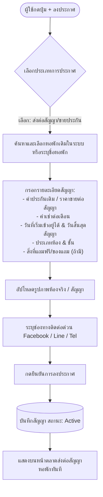
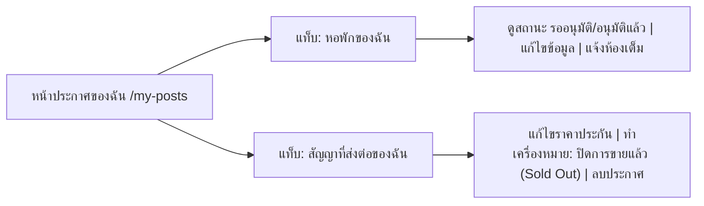
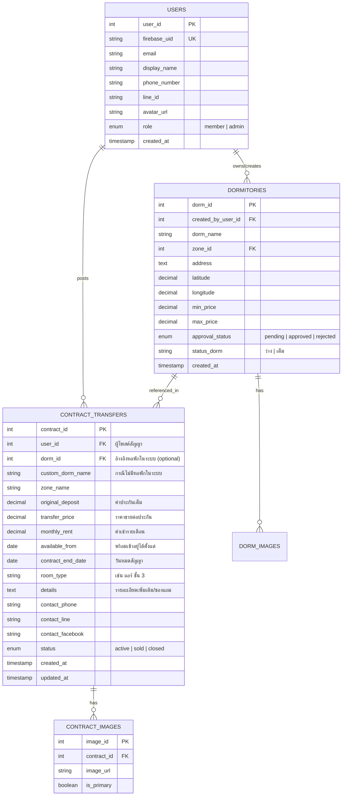

# 📘 เอกสารออกแบบระบบและโฟลว์การทำงาน (System Architecture & Flow Design)
## โครงการ DormoraMSU: การเพิ่มระบบสมาชิกและตลาดส่งต่อสัญญา/ขายประกันหอพัก

---

## 1. ภาพรวมและสถานะปัจจุบันของระบบ (Current System Overview)

ปัจจุบัน **DormoraMSU** เป็นเว็บแอปพลิเคชันค้นหาและรวบรวมข้อมูลหอพักรอบมหาวิทยาลัยมหาสารคาม (มมส) โดยมีโครงสร้างการทำงานเดิมดังนี้:

### 🔄 โฟลว์การทำงานในปัจจุบัน (Current Workflow)
1. **ผู้ใช้งานทั่วไป (Public Visitors)**:
   - สามารถเข้าชมหน้าเว็บ ค้นหาหอพัก กรองตามโซน/ราคา/สิ่งอำนวยความสะดวก ดูแผนที่แบบ Interactive และเปรียบเทียบหอพักได้ทันทีโดยไม่ต้องล็อกอิน
2. **การส่งข้อมูลหอพัก (Dorm Submission)**:
   - เปิดให้ใครก็ได้กรอกฟอร์ม 4 ขั้นตอนที่หน้า `/dorm-submit` เพื่อส่งข้อมูลหอพักใหม่ (ที่ตั้ง, พิกัด Map, อัปโหลดรูปภาพขึ้น Supabase Storage, สิ่งอำนวยความสะดวก)
   - ข้อมูลที่ส่งจะอยู่ในสถานะ **"รออนุมัติ (Pending)"**
3. **ระบบผู้ดูแลระบบ (Admin Management)**:
   - แอดมินเข้าสู่ระบบผ่าน Firebase Auth ที่หน้า `/admin/login` เพื่อเข้าสู่ Dashboard `/admin`
   - แอดมินทำหน้าที่ตรวจสอบข้อมูลหอพัก ตรวจจับหอพักซ้ำ (Duplicate Check) และกด **อนุมัติ (Approve)** หรือ **ไม่อนุมัติ (Reject)** ข้อมูลหอพักก่อนขึ้นแสดงบนหน้าเว็บหลัก



### ⚠️ ข้อจำกัดของระบบปัจจุบัน
* **ผู้ส่งข้อมูลไม่สามารถติดตามหรือจัดการข้อมูลได้**: ผู้ลงประกาศไม่สามารถกลับมาแก้ไข ลบ หรืออัปเดตสถานะห้องว่าง/เต็มได้ด้วยตัวเอง เนื่องจากไม่มีระบบผูกกับบัญชีผู้ใช้
* **ยังไม่ตอบโจทย์ความต้องการเรื่องสัญญาหอพัก**: นิสิต มมส มีความต้องการสูงมากในการหาคนมาเช่าหอต่อเพื่อขอรับเงินประกันคืน (การขายสัญญา/ขายประกันหอพัก) ซึ่งปัจจุบันยังไม่มีพื้นที่รองรับในระบบ

---

## 2. คอนเซปต์การพัฒนาระบบใหม่ (Enhanced Concept: Single Account + Post Types)

เพื่อแก้ไขข้อจำกัดเดิมและขยายศักยภาพของแพลตฟอร์ม เราจะใช้แนวทาง **"สมัครสมาชิกบัญชีเดียว (Single Member Account) แล้วแยกฟังก์ชันตามประเภทการโพสต์ (Post-Type Based)"**

```
                  ┌─────────────────────────────────┐
                  │      ผู้ใช้งานสมัครสมาชิก/เข้าสู่ระบบ     │
                  │       (Single Member Account)   │
                  └────────────────┬────────────────┘
                                   │
                                   ▼
                  ┌─────────────────────────────────┐
                  │       กดปุ่ม "+ ลงประกาศใหม่"      │
                  └────────────────┬────────────────┘
                                   │
                 ┌─────────────────┴─────────────────┐
                 ▼                                   ▼
    ┌───────────────────────────┐       ┌───────────────────────────┐
    │ 🏢 โพสต์โปรโมทหอพักให้เช่า   │       │ 🔑 โพสต์ส่งต่อสัญญา/ขายประกัน │
    │ (สำหรับเจ้าของหอ/ผู้ดูแล)    │       │ (สำหรับนิสิต/ผู้เช่าเดิม)     │
    └───────────────────────────┘       └───────────────────────────┘
```

### 🌟 ประโยชน์ของแนวทางนี้
1. **สมัครง่าย (Frictionless Onboarding)**: นิสิตหรือเจ้าของหอพักสมัครด้วยขั้นตอนเดียวกัน ไม่ต้องกังวลเรื่องการเลือก Role ผิด
2. **ความยืดหยุ่นสูง (High Flexibility)**: บัญชีเดียวกันสามารถโพสต์โปรโมทหอพัก หรือจะโพสต์ส่งต่อสัญญาหอพักก็ได้
3. **เชื่อมโยงข้อมูลหอพักเดิม (Data Synergy)**: นิสิตที่ต้องการขายสัญญา สามารถเลือกผูกกับข้อมูลหอพักที่มีอยู่ในระบบได้ทันที ทำให้ไม่ต้องเสียเวลาพิมพ์พิกัดหรือข้อมูลหอพักใหม่ทั้งหมด
4. **รองรับการขยายตัวในอนาคต (Scalability)**: สามารถเพิ่มประเภทโพสต์ใหม่ เช่น *"หารูมเมท (Find Roommate)"* หรือ *"ส่งต่อของใช้ในหอ"* ได้ทันทีโดยไม่ต้องปรับโครงสร้างสิทธิ์

---

## 3. แผนภาพลำดับการทำงานแบบละเอียด (Detailed System Flows)

### 3.1 Flow การสมัครและเข้าสู่ระบบ (Authentication Flow)



---

### 3.2 Flow A: การลงประกาศหอพักให้เช่า (Dorm Listing Flow - เจ้าของหอ)



---

### 3.3 Flow B: การส่งต่อสัญญา / ขายประกันหอพัก (Contract Transfer Flow - นิสิต)



---

### 3.4 Flow C: การจัดการประกาศของฉัน (My Posts Management)

ผู้ใช้สามารถเข้าถึงหน้า **"ประกาศของฉัน (My Posts)"** เพื่อดูรายการทั้งหมดที่ตนเองเคยสร้างไว้:



---

## 4. การออกแบบโครงสร้างฐานข้อมูล (Database Schema Enhancement)



---

## 5. การออกแบบหน้าจอและส่วนติดต่อผู้ใช้งาน (UI/UX Specification)

| หน้าจอ (Screen) | เส้นทาง (Route) | รายละเอียดและฟังก์ชันการทำงาน |
|---|---|---|
| **แถบนำทาง (Navbar)** | ทุกหน้า | เพิ่มแท็บ **"ตลาดส่งต่อสัญญา"** และปุ่ม **"+ ลงประกาศ"** พร้อม Dropdown โปรไฟล์ผู้ใช้ |
| **หน้าเลือกประเภทประกาศ** | `/create-post` | เลือกระหว่างการ์ด 2 แบบ: <br>1. 🏢 *โปรโมทหอพัก* (เข้าสู่ Dorm Submit Form)<br>2. 🔑 *ส่งต่อสัญญาหอ* (เข้าสู่ Contract Submit Form) |
| **หน้าตลาดส่งต่อสัญญา** | `/contracts` | หน้ารวมการ์ดโพสต์ส่งต่อสัญญา พร้อมตัวกรอง (โซน, ช่วงราคาประกัน, ค่าเช่าต่อเดือน, วันพร้อมเข้าอยู่) |
| **หน้ารายละเอียดสัญญา** | `/contracts/:id` | แสดงรูปห้องจริง, ข้อมูลหอพัก, ราคาขายต่อประกันเทียบกับราคาเต็ม, วันหมดสัญญา, และปุ่มติดต่อผู้โพสต์ (โทร/Line/Facebook) |
| **หน้าประกาศของฉัน** | `/my-posts` | จัดการประกาศทั้งหมดของผู้ใช้ (แก้ไข, ลบ, สลับสถานะห้องว่าง/ปิดการขาย) |
| **หน้า Admin Moderation** | `/admin` | เพิ่มแท็บสำหรับตรวจสอบและจัดการทั้งหอพักใหม่ และประกาศส่งต่อสัญญา |

---

## 6. แผนการดำเนินงาน (Implementation Roadmap)

1. **Phase 1: Authentication & User Profile System**
   - เปิดระบบสมัครสมาชิก/เข้าสู่ระบบสำหรับผู้ใช้ทั่วไป (Member Login via Firebase & Backend User Sync)
   - ปรับปรุง Navigation Bar ให้รองรับ Profile Dropdown และปุ่มสร้างประกาศ
2. **Phase 2: Contract Transfer Module (Frontend & Backend)**
   - สร้างตาราง `contract_transfers` และ `contract_images` ในฐานข้อมูล
   - พัฒนา REST APIs สำหรับ CRUD โพสต์ส่งต่อสัญญา
   - พัฒนาหน้าฟอร์มสร้างประกาศส่งต่อสัญญา (`/contracts/create`) พร้อมระบบเลือกหอพักเดิม
   - พัฒนาหน้ารวมตลาดส่งต่อสัญญา (`/contracts`) และหน้ารายละเอียดสัญญา (`/contracts/:id`)
3. **Phase 3: My Posts & Management Dashboard**
   - พัฒนาหน้า "ประกาศของฉัน (`/my-posts`)" ให้ผู้ใช้จัดการโพสต์ตัวเองได้
   - เพิ่มระบบเปลี่ยนสถานะเป็น "ปิดการขายแล้ว (Sold Out)"
4. **Phase 4: Admin Moderation & Polish**
   - เพิ่มแท็บตรวจสอบและดูแลความเรียบร้อยของตลาดสัญญาในหน้า `/admin`
   - ทดสอบความปลอดภัย และความลื่นไหลของระบบบนมือถือ (Responsive UI)

